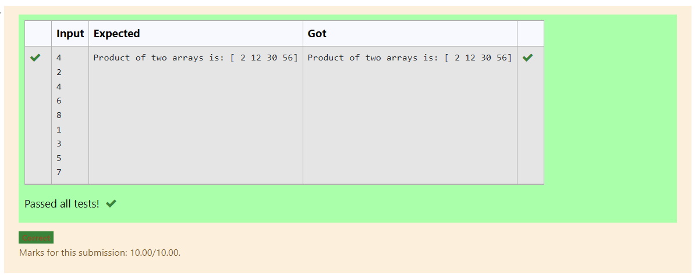

# Multiplying-two-matrix

# AIM:
To write a python program for Multiplying two matrices.

# ALGORITHM:

### Step 1:
Start python program
### Step 2:
Import numpy.create two null lists.
### Step 3:
Get two matrices from the user using append.
### Step 4:
Multiply the two matrices.
### Step 5:
Display the result.

## PROGRAM: 
~~~
import numpy as np
l1,l2=[],[]
n=int(input())
for i in range(n):
    l1.append(int(input()))
for j in range(n):
    l2.append(int(input()))
array_1=np.array(l1)
array_2=np.array(l2)
product=array_1*array_2
print("Product of two arrays is:",product)
~~~

## OUTPUT:

# RESULT:
Thus the multiplication of matrix is done

